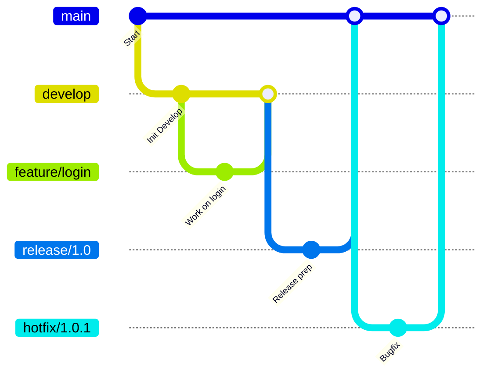

# 📌 Git: Workspace, Staging Area, and Repository

## 1. **Workspace (Working Directory)**

* This is where you **create or edit files** on your computer.
* Files in the workspace are not yet tracked by Git until you add them.

👉 Example:

```bash
echo "Hello Git" > file.txt
```

At this point, `file.txt` is only in the **workspace**.

---

## 2. **Staging Area (Index / Cache)**

* Intermediate area where Git keeps track of files that are marked to go into the next commit.
* You move files here using `git add`.

👉 Example:

```bash
git add file.txt
```

Now `file.txt` is **staged** (ready to commit).

---

## 3. **Repository**

* This is the **database where Git permanently stores commits**.
* Once you `git commit`, the staged files are written into the repository.

👉 Example:

```bash
git commit -m "Added file.txt"
```

Now the changes are part of the **local repository history**.

---

## 🔄 Flow Summary

```mermaid
flowchart LR
    A[Workspace<br>(Working Directory)] -->|git add| B[Staging Area<br>(Index)]
    B -->|git commit| C[Local Repository]
    C -->|git push| D[Remote Repository<br>(GitHub/GitLab/Bitbucket)]
```

---

## 🔑 Commands Recap

| Step            | Command Example                 | Purpose                                            |
| --------------- | ------------------------------- | -------------------------------------------------- |
| Check status    | `git status`                    | Shows where files are (workspace / staging / repo) |
| Stage changes   | `git add <file>` or `git add .` | Move changes → staging area                        |
| Unstage changes | `git restore --staged <file>`   | Remove from staging → back to workspace            |
| Commit changes  | `git commit -m "message"`       | Save changes into repository                       |
| Push to remote  | `git push origin main`          | Send commits → GitHub remote repo                  |

---

# 🌿 Git Branching Strategies

## 1. **Feature Branching**

* Each new feature or task is developed in its **own branch**.
* Keeps `main` or `master` branch stable.
* After development & testing, merge via Pull Request (PR).

👉 Flow:

```bash
git checkout -b feature/login-page
# work on feature
git add .
git commit -m "Added login page"
git push origin feature/login-page
```

✅ Pros: Isolates work, easier code reviews.
❌ Cons: Many small branches may exist at the same time.

---

## 2. **Git Flow**

* A **structured branching model** for large projects.
* Main branches:

  * `main` → always production-ready
  * `develop` → integration branch for features
* Supporting branches:

  * `feature/*` (for new features)
  * `release/*` (for preparing releases)
  * `hotfix/*` (for urgent fixes in production)

👉 Flow Summary:



✅ Pros: Good for **complex, enterprise projects**.
❌ Cons: Can feel heavy for small teams.

---

## 3. **GitHub Flow**

* Lightweight branching model.
* Everything starts from `main`.
* For every change → create a **feature branch**, open PR, merge back into `main`.

👉 Flow:

```bash
git checkout -b feature/new-report
git push origin feature/new-report
# Open PR → Merge → Deploy
```

✅ Pros: Simple, widely used in **CI/CD + DevOps pipelines**.
❌ Cons: Not ideal for projects requiring **multiple release versions**.

---

## 4. **Trunk-Based Development**

* Developers work in **short-lived branches** or directly on `main`.
* Merges happen **daily or multiple times a day**.
* Works best with **feature flags** to hide incomplete features in production.

👉 Flow:

```bash
git checkout -b small-change
git commit -m "Fix typo"
git push origin small-change
# merge same day
```

✅ Pros: Continuous integration friendly, fast releases.
❌ Cons: Needs discipline & automated tests.

---

## 5. **Release Branching**

* Used when you need to **maintain multiple versions** of software.
* Each release gets its own branch (`release/1.0`, `release/2.0`).

✅ Pros: Great for software with **long support cycles**.
❌ Cons: Overhead of maintaining many release branches.

---

## 🔑 Choosing the Right Strategy

| Strategy              | Best For                           |
| --------------------- | ---------------------------------- |
| **Feature Branching** | Small/medium teams, isolated tasks |
| **Git Flow**          | Enterprise, complex releases       |
| **GitHub Flow**       | Modern CI/CD, startups             |
| **Trunk-Based**       | Agile, fast-paced teams            |
| **Release Branching** | Products with long-term support    |

---

⚡ **Rule of Thumb**:

* Small teams → **GitHub Flow**
* Large teams → **Git Flow**
* DevOps CI/CD heavy projects → **Trunk-Based Development**

---
